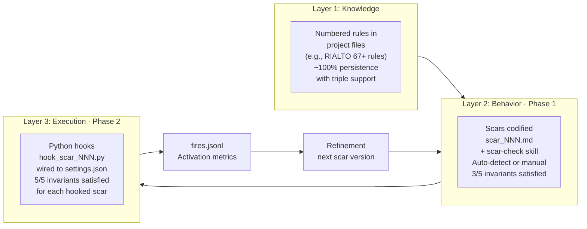
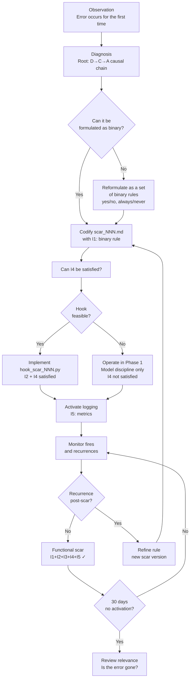

# Lucy Syndrome Framework — Architecture

Visual reference for the three-layer architecture and scar lifecycle.
These diagrams complement the conceptual description in [framework/README.md](README.md).

---

## Three-Layer Architecture

**Layer 1 — Knowledge** is what already works: numbered, binary rules in project files with redundant support. It exists in every mature operator system, usually undocumented as a "system". Lucy Syndrome research found this layer in production under the code name RIALTO.

**Layer 2 — Behavior** (Phase 1) generalizes the pattern: explicit scar files with the five-invariant schema, plus a skill the model can invoke. Limitation: the model still *chooses* whether to apply the scar, which is the root mechanism of the Syndrome itself.

**Layer 3 — Execution** (Phase 2) closes the gap: hooks fire automatically at the harness level, independent of model choice. Each hook that fires constitutes I4 (non-passive technical trigger at inference time). The logging loop (I5) feeds refinement back into Layer 2.

---

## Scar Lifecycle

**Key insight from the lifecycle:** a scar is not a note — it's a rule with a test. If you can't write a binary test for it (C → No), the rule is not a scar yet. Reformulate until it is.

The refinement loop (L → N → E) is the evidence that the system learns. See `examples/production-case/` for a documented case where scar_004 went from version 1 to version 2 after a formal incident analysis.

---

## The Five Invariants at a Glance

| # | Invariant | What fails without it |
|---|---|---|
| I1 | Binary rule | Proportional rules leak at 80%+ |
| I2 | Durable physical support | Memory-only rules degrade to 0% |
| I3 | Structural integration | Additive notes don't change the output shape |
| I4 | Non-passive technical trigger at inference time | The model decides whether to apply — that's the Syndrome |
| I5 | Refinable activation metric | You cannot improve what you do not measure |

A scar satisfying fewer than five invariants is a well-organized note. Three out of five is not a functional scar.

---

## Escalation Policy

Hooks can fire at three severity levels:

| Level | When to use | Operator experience |
|---|---|---|
| `warn` | Recoverable error, high expected frequency, filter still being calibrated | Message injected; model continues |
| `confirm` | Costly but reversible error; or critical scar without a hook yet | Hook requires explicit operator confirmation before proceeding |
| `deny` | Irreversible action with high confidence filter (false positive rate < 5%) | Hook blocks; operator must restart |

**Default recommendation:** start all hooks at `warn`. Move to `confirm` only after ≥ 4 weeks of `fires.jsonl` data showing the filter is reliable. Move to `deny` only when false positive rate is below 5% with confidence.

Rationale: a blocking hook that fires on a false positive creates an incident. A warn-severity hook that fires on a false positive creates noise — and noise can be refined out of existence.

---

*Diagrams best viewed in a Markdown renderer that supports Mermaid (GitHub, GitLab, VS Code with Mermaid extension).*
